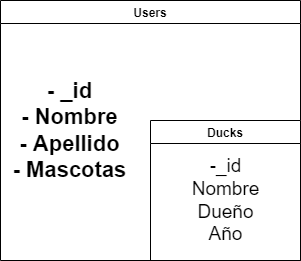

# PROYECTO FINAL

# Equipo:
- Javier Eduardo Alemán Ortíz
- Isaac Adrián Cisneros García
- Luis Alberto Ibarra Espinoza
- Francisco Antonio Ferrer Ferrer
- Pablo Valera Rangel
- Erick Díaz Delabra

## Para el proyecto utilizamos:
- [Python 3.10.0](https://www.python.org/downloads/release/python-3100/)
- [Postman](https://www.postman.com/) (Para realizar peticiones a las API `opcional`)
- [NodeJS](https://nodejs.org/es/) **LTS** 
- [Redis](https://github.com/microsoftarchive/redis/releases)

## Documentacion
- [React](https://create-react-app.dev/)
- [Flask](https://flask.palletsprojects.com/en/2.0.x/)
- [Redis](https://github.com/redis/redis-py)

## Instrucciones
- Clonar el respositorio
- Mediante la consola utilizar el siguiente comando
```
docker-compose up --build
```
### Diagrama Base de Datos


### Diagrama Base de Datos
:(
